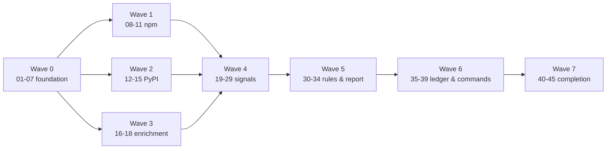

# vetlock — v1 Issue Plan

Status: draft for review · 2026-07
Source of truth: [DESIGN.md](DESIGN.md). Every issue below exists as a full
draft in [docs/issues/](issues/); GitHub Issues are generated from those
drafts and are derived artifacts.

## 1. v1 completion statement

> **v1 is complete when all 45 issues below are implemented and validated.**
> At that point: `npx vetlock check <pkg>` produces a deterministic,
> evidence-cited trust report with a pass/warn/fail verdict for any npm or
> PyPI package; `vetlock approve`/`reject` maintain a committable
> `vetlock.json` ledger; `vetlock verify` enforces, offline and in CI, that
> every direct dependency (exact version) of an npm and/or
> pyproject+uv project has an approved ledger entry; all security invariants
> S1–S8 (ADR-007) have named passing tests; the package builds, passes the
> full CI matrix, and `npm publish --provenance` is one human action away.
> The only work outside these issues is the human-only manual step list
> (§8) and newly discovered unknowns (§9).

## 2. Issue list (recommended execution order)

| # | File | Title | Wave |
|---|------|-------|------|
| 01 | [01-project-scaffolding.md](issues/01-project-scaffolding.md) | Project scaffolding & toolchain | 0 |
| 02 | [02-ci-workflow.md](issues/02-ci-workflow.md) | CI workflow (lint, typecheck, test matrix) | 0 |
| 03 | [03-cli-shell.md](issues/03-cli-shell.md) | CLI shell: entrypoint, global flags, errors, logging | 0 |
| 04 | [04-http-client.md](issues/04-http-client.md) | HTTP client with host allowlist | 0 |
| 05 | [05-file-cache.md](issues/05-file-cache.md) | File cache (TTL, ETag, offline) | 0 |
| 06 | [06-package-spec-parser.md](issues/06-package-spec-parser.md) | Package spec parser & ecosystem resolution | 0 |
| 07 | [07-ecosystem-adapter-interface.md](issues/07-ecosystem-adapter-interface.md) | Ecosystem adapter interface & registry | 0 |
| 08 | [08-npm-name-and-versions.md](issues/08-npm-name-and-versions.md) | npm name validation & version ordering | 1 |
| 09 | [09-npm-registry-client.md](issues/09-npm-registry-client.md) | npm registry client | 1 |
| 10 | [10-npm-manifest-reader.md](issues/10-npm-manifest-reader.md) | npm manifest & lockfile reader | 1 |
| 11 | [11-npm-adapter-assembly.md](issues/11-npm-adapter-assembly.md) | npm adapter assembly (facts mapping) | 1 |
| 12 | [12-pypi-name-and-versions.md](issues/12-pypi-name-and-versions.md) | PyPI name normalization & version handling | 2 |
| 13 | [13-pypi-registry-client.md](issues/13-pypi-registry-client.md) | PyPI registry client | 2 |
| 14 | [14-python-manifest-reader.md](issues/14-python-manifest-reader.md) | Python manifest reader (pyproject + uv.lock) | 2 |
| 15 | [15-pypi-adapter-assembly.md](issues/15-pypi-adapter-assembly.md) | PyPI adapter assembly (facts mapping) | 2 |
| 16 | [16-depsdev-client.md](issues/16-depsdev-client.md) | deps.dev v3 client | 3 |
| 17 | [17-osv-client.md](issues/17-osv-client.md) | OSV client | 3 |
| 18 | [18-github-client.md](issues/18-github-client.md) | GitHub client & repo-URL parsing | 3 |
| 19 | [19-signal-framework.md](issues/19-signal-framework.md) | Signal framework & orchestrator | 4 |
| 20 | [20-metadata-collectors.md](issues/20-metadata-collectors.md) | Metadata collectors (6 signals) | 4 |
| 21 | [21-maintainer-collectors.md](issues/21-maintainer-collectors.md) | Maintainer collectors (2 signals) | 4 |
| 22 | [22-repository-collectors.md](issues/22-repository-collectors.md) | Repository collectors (3 signals) | 4 |
| 23 | [23-provenance-collector.md](issues/23-provenance-collector.md) | Provenance/attestation collector | 4 |
| 24 | [24-execution-collectors.md](issues/24-execution-collectors.md) | Execution-surface collectors (3 signals) | 4 |
| 25 | [25-vulnerability-collectors.md](issues/25-vulnerability-collectors.md) | Vulnerability collectors (OSV) | 4 |
| 26 | [26-popularity-collector.md](issues/26-popularity-collector.md) | Popularity collector (downloads) | 4 |
| 27 | [27-top-packages-dataset.md](issues/27-top-packages-dataset.md) | Top-packages dataset & update script | 4 |
| 28 | [28-typosquat-collector.md](issues/28-typosquat-collector.md) | Typosquat collector | 4 |
| 29 | [29-license-footprint-collectors.md](issues/29-license-footprint-collectors.md) | License & footprint collectors (3 signals) | 4 |
| 30 | [30-rule-engine.md](issues/30-rule-engine.md) | Rule engine & policy resolution | 5 |
| 31 | [31-default-ruleset.md](issues/31-default-ruleset.md) | Default ruleset (22 rules) | 5 |
| 32 | [32-report-model-json.md](issues/32-report-model-json.md) | Report model, digest & JSON renderer | 5 |
| 33 | [33-terminal-renderer.md](issues/33-terminal-renderer.md) | Sanitizer & terminal renderer | 5 |
| 34 | [34-markdown-renderer.md](issues/34-markdown-renderer.md) | Markdown renderer | 5 |
| 35 | [35-ledger-schema-io.md](issues/35-ledger-schema-io.md) | Ledger schema & atomic IO | 6 |
| 36 | [36-approve-reject-commands.md](issues/36-approve-reject-commands.md) | approve / reject commands | 6 |
| 37 | [37-verify-engine-command.md](issues/37-verify-engine-command.md) | verify engine & command | 6 |
| 38 | [38-list-command.md](issues/38-list-command.md) | list command | 6 |
| 39 | [39-check-command.md](issues/39-check-command.md) | check command orchestration | 6 |
| 40 | [40-e2e-test-suite.md](issues/40-e2e-test-suite.md) | E2E CLI test suite & fixture projects | 7 |
| 41 | [41-user-documentation.md](issues/41-user-documentation.md) | User documentation (README, usage, signals) | 7 |
| 42 | [42-security-hardening-audit.md](issues/42-security-hardening-audit.md) | SECURITY.md & S1–S8 conformance audit | 7 |
| 43 | [43-release-packaging.md](issues/43-release-packaging.md) | Release packaging & publish workflow | 7 |
| 44 | [44-repo-governance.md](issues/44-repo-governance.md) | Repository governance & automation files | 7 |
| 45 | [45-live-smoke-script.md](issues/45-live-smoke-script.md) | Live-API smoke script (manual QA) | 7 |

## 3. Dependency table

`⇐` = "blocked by". Issues not listed as blockers of each other may proceed
in parallel within their wave.

| Issue | Blocked by |
|---|---|
| 01 | — |
| 02 | 01 |
| 03 | 01 |
| 04 | 01 |
| 05 | 01, 04 |
| 06 | 03, 07 |
| 07 | 01 |
| 08 | 07 |
| 09 | 04, 05 |
| 10 | 07 |
| 11 | 07, 08, 09, 10 |
| 12 | 07 |
| 13 | 04, 05 |
| 14 | 07, 12 |
| 15 | 07, 12, 13, 14 |
| 16 | 04, 05 |
| 17 | 04, 05 |
| 18 | 04, 05 |
| 19 | 07, 03 |
| 20 | 19, 11 (uses PackageFacts; PyPI cases also need 15) |
| 21 | 19, 11 |
| 22 | 19, 16, 18 |
| 23 | 19, 09, 13 |
| 24 | 19, 11, 15 |
| 25 | 19, 17 |
| 26 | 19, 09, 13 |
| 27 | 01 |
| 28 | 19, 27 |
| 29 | 19, 16, 11 |
| 30 | 19 |
| 31 | 30, 20–26, 28, 29 (signal shapes) |
| 32 | 30, 19 |
| 33 | 32 |
| 34 | 32 |
| 35 | 01, 30 (policy schema) |
| 36 | 35, 06, 11, 15 |
| 37 | 35, 10, 14 |
| 38 | 35 |
| 39 | 06, 11, 15, 19, 31, 32, 33, 34 |
| 40 | 36, 37, 38, 39 |
| 41 | 39, 37 (documents final behavior) |
| 42 | 40 (audits the finished surface) |
| 43 | 40, 02 |
| 44 | 01 |
| 45 | 39 |

Mermaid overview (waves compressed):

## 4. Implementation waves

| Wave | Issues | Theme | Exit criterion |
|---|---|---|---|
| 0 | 01–07 | toolchain, CLI shell, infra primitives, adapter contract | `npm test` green; `vetlock --help` runs; http/cache/spec units pass |
| 1 | 08–11 | npm ecosystem end-to-end data access | npm PackageFacts assembled from fixtures |
| 2 | 12–15 | PyPI ecosystem (proves the adapter interface) | PyPI PackageFacts assembled from fixtures |
| 3 | 16–18 | enrichment clients (deps.dev, OSV, GitHub) | typed clients green on fixtures |
| 4 | 19–29 | signal framework + all 22 signals | orchestrator emits full catalog for fixture packages |
| 5 | 30–34 | rules, policy, report model, all renderers | golden reports for fixture packages |
| 6 | 35–39 | ledger, approve/reject/verify/list/check | full product loop works locally |
| 7 | 40–45 | e2e, docs, security audit, release readiness | v1 completion statement (§1) holds |

Waves 1, 2, 3 can run in parallel after wave 0; issue 27 can start any time
after 01.

## 5. Coverage table (DESIGN.md → issues)

| DESIGN.md section | Covered by issues |
|---|---|
| §4.1 stack/deps | 01 |
| §4.2 module layout | all (structure), enforced in 01, 07 |
| §5 CLI contract | 03 (shell/global), 36, 37, 38, 39 (per command) |
| §6 spec grammar & name validation | 06, 08, 12 |
| §7 adapter contract | 07, 11, 15 |
| §8 manifest readers | 10, 14 |
| §9 signal framework & catalog | 19; catalog: 20, 21, 22, 23, 24, 25, 26, 28, 29 |
| §9.3 typosquat | 27, 28 |
| §10 rule engine & policy | 30, 31 |
| §11 report & renderers | 32, 33, 34 |
| §12 ledger | 35, 36 |
| §13 verify | 37 |
| §14 http/cache/clients | 04, 05, 16, 17, 18 |
| §15 errors & exit codes | 03 (hierarchy), every command issue (mapping) |
| §16 security model | S-invariants embedded in 04, 05, 06, 33, 35 + audit 42 |
| §17 testing strategy | per-issue Validation sections + 40 |
| §18 performance budgets | 39, 40 |
| §19 packaging & release | 01 (fields), 43 |
| §20 governance & docs | 41, 44; §20.3 dataset: 27 |
| §21 known unknowns | §9 below |

Inverse check: every issue references the DESIGN sections it implements in
its "Design References" section — no orphan issues, no uncovered sections.

## 6. Whole-product validation strategy

1. **Per-issue gates** — every issue's Validation section names the exact
   commands (`npm run lint && npm run typecheck && npm test -- <scope>`)
   and the tests that must exist; implementation agents may not substitute
   weaker checks.
2. **Fixture-only CI** — no live network in CI (DESIGN §17); recorded
   fixtures are added by the issue that introduces each client.
3. **Golden artifacts** — Report JSON, terminal output, and ledger files
   have golden snapshots (volatile fields normalized) from issue 32/33/35
   onward; any diff is a conscious decision.
4. **E2E loop** — issue 40 executes the real built CLI over fixture
   projects for the full check→approve→verify loop, all verify statuses,
   both ecosystems, plus corrupt/hostile fixtures.
5. **Security conformance** — issue 42 re-audits S1–S8 with a checklist
   mapping each invariant to its named test; failures block v1.
6. **Release rehearsal** — issue 43 proves `npm pack` contents and the
   publish workflow in dry-run; issue 45 provides the manual live-API smoke
   for pre-release QA.

## 7. Deferred to v2 (out of scope for this plan)

GitHub Action + PR comments · MCP server · additional ecosystems (Cargo, Go,
RubyGems, Maven) · additional manifests (yarn/pnpm/poetry/requirements.txt/
PEP 751 pylock, npm workspaces) · range-based approval policy · org-shared
ledgers · SARIF output · PyPI file-integrity pinning · full Sigstore bundle
verification · `vetlock init` · dependents-count signal · brew/single-binary
distribution · scheduled top-packages refresh workflow.

## 8. Manual steps (repository owner only — not issues)

| When | Action |
|---|---|
| after this PR merges | rename GitHub repo `trustlock` → `vetlock`; update repo description to match README; rename local directory at convenience (ADR-005) |
| before first release | register npm package name `vetlock` (manual publish of first real version; no placeholder squatting); enable npm 2FA; create `NPM_TOKEN` secret only if the release workflow design in issue 43 requires it (prefer local manual publish otherwise) |
| release gate | run issue-45 smoke script; trigger release workflow / `npm publish --provenance` (merge ≠ release) |

## 9. Known unknowns that may create additional issues

Tracked in DESIGN §21 (U1–U9). Expected issue-shaped fallout:

- U1/U3 (attestation schema, uv.lock revisions): small fast-follow parser
  fixes inside issues 09/13/14's modules.
- U6 (dataset licenses): if redistribution is disallowed, issue 27 gains a
  follow-up "generate at build, don't commit" issue.
- U7 (non-GitHub repo hosts): candidate v1.1 issue "GitLab/Codeberg
  repository status support".
- U8 (workspaces demand): candidate v1.1 issue "npm workspaces direct-dep
  enumeration".
